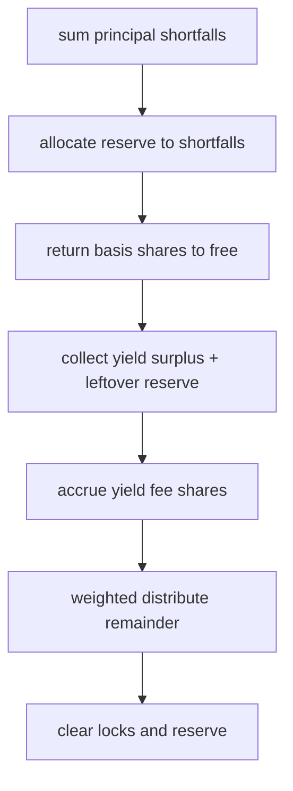

# End settlement

The last successful `tick` sets `ended`, then calls `_end_pasanaku`. Settlement does not revert solely because the vault lost value. Shortfalls are covered from the miss reserve when possible; remaining shortfalls are socialized by reducing returned principal shares.

## Order of operations



### 1. Measure shortfalls

For each participant, if `previewWithdraw(basis) > locked`, add the share gap to `total_shortfall`.

### 2. Allocate reserve to shortfalls

```text
available_reserve = min(pool_reserve_shares, total_shortfall)
leftover_reserve = pool_reserve_shares - available_reserve
```

Walking participants again, each shortfall receives a proportional slice of `available_reserve` (last shortfall absorbs rounding via remaining counters). Returned shares for an underwater participant become `locked + allocation`.

### 3. Return principal and collect surplus

For solvent participants (`locked >= required`):

- return `required` shares to free (the asset basis)
- add `locked - required` to `yield_surplus`

For underwater participants, return the allocated amount above. Clear each participant's locked shares and basis.

Zero `_pool_reserve_shares[token_id]`.

### 4. Yield fee vs leftover reserve

Fee is charged **only on vault yield** (shares above remaining basis), using the pool's snapshotted `yield_fee` bps:

```text
fee_shares = yield_surplus * yield_fee / 10_000
distributable_yield = (yield_surplus - fee_shares) + leftover_reserve
```

Leftover miss-penalty reserve joins distributable yield **without** paying the yield fee. Fee shares accumulate in `_collected_fee_shares` for a later owner redeem via `collect_yield_fees`—end settlement does not transfer them in the same call.

### 5. Weighted participant distribution

```text
total_weight = N * (N + 1) / 2
participant i (0-based shuffled index) receives
  distributable_yield * (i + 1) / total_weight
```

The final participant receives any integer dust:

```text
distribution = distributable_yield - distributed_so_far
```

Credits go to free shares. Emits `PasanakuSurplusDistributed`.

## What participants walk away with

After end settlement, a participant's free shares include:

1. Returned principal shares (basis, possibly reserve-topped).
2. Their weighted slice of distributable surplus.
3. Whatever free shares they already held outside this pool.

Liquid round payouts remain separate: recipients must still `claim_round_payout` for any unclaimed `_pending_payout` balances.

## See also

- [Admin and fees](./admin.md)
- `CONTEXT.md` — End settlement
- `tests/unitary/pasanaku/test_fees.py`, `test_lifecycle.py`
