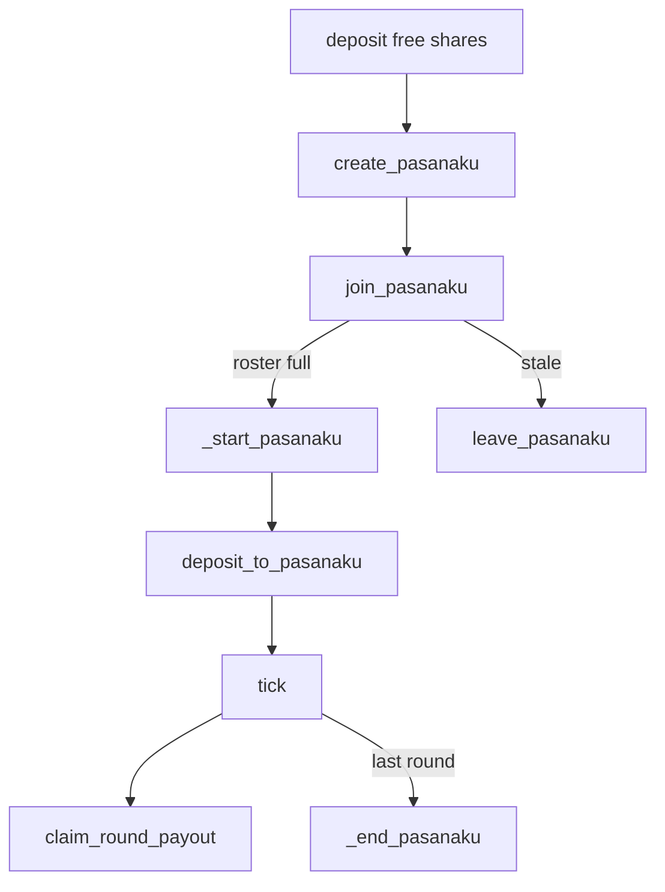

# Overview

Pasanaku is a single Vyper contract that runs fixed-membership rotating savings pools against one immutable ERC-20 asset and one immutable ERC-4626 vault. Vault shares are the canonical collateral unit.

Say “three-participant pasanaku,” “six-participant pasanaku,” “nine-participant pasanaku,” or “twelve-participant pasanaku.” Do not describe size as a continuous range from three to twelve.

## Deployment model

Each deployed instance binds:

| Immutable | Role                                             |
| --------- | ------------------------------------------------ |
| `_ASSET`  | Underlying ERC-20 for round deposits and payouts |
| `_VAULT`  | ERC-4626 vault that holds collateral shares      |

The constructor requires `vault.asset() == asset`. Pools do not choose assets or vaults. Many pools can run concurrently on the same instance; `token_id` scopes locked shares, reserve, escrow, and payouts.

## What a pasanaku is

A pasanaku is a `Pasanaku` struct keyed by `token_id`:

- `round_assets` — per-round obligation in raw asset units
- `participant_count` — exactly `3`, `6`, `9`, or `12`
- `participants` — roster; after start, index `k` is the recipient of round `k`
- `index` — next round for `tick`
- `created` / `stale_time` — pending-pool lifetime
- `yield_fee` — fee bps snapshotted at create
- `started` / `updated` / `ended` — lifecycle timestamps (`0` means unset)

## Lifecycle



1. Users `deposit` underlying; the contract vaults it and credits free shares.
2. A creator calls `create_pasanaku(round_assets, participant_count)` and locks a pledge.
3. Others `join_pasanaku` until the roster fills, which calls `_start_pasanaku`.
4. Each round, obligors (everyone except the current recipient) fund exactly `round_assets` via `deposit_to_pasanaku`.
5. After `_MIN_TIME_INTERVAL` (28 days) from the last tick or start, anyone may `tick`.
6. The recipient `claim_round_payout` pulls accrued assets. Unclaimed payouts do not block later ticks.
7. The final tick runs `_end_pasanaku`: principal return, reserve shortfall cover, yield fee accrual, weighted surplus distribution.

## Accounting layers

Two ledgers coexist:

**Vault shares (owned by the contract)**

```text
vault.balanceOf(Pasanaku)
  = all free shares
  + all locked shares
  + all pool reserve shares
```

**Liquid underlying (held by the contract)**

- `_pool_escrow[token_id]` — current-round contributions / slash recoveries
- `_pending_payout[token_id][round_idx]` — claimable recipient balances

Escrow and pending payouts are outside the share invariant.

## Yield boundary

Pool yield accounting begins at `_start_pasanaku`, not at create or join. Pre-start vault appreciation or loss is normalized into free shares when the pool starts. After start, locked-share appreciation is pooled surplus at end settlement.

## See also

- Domain guardrails: repository `CONTEXT.md`
- Unitary lifecycle coverage: `tests/unitary/pasanaku/test_lifecycle.py`
