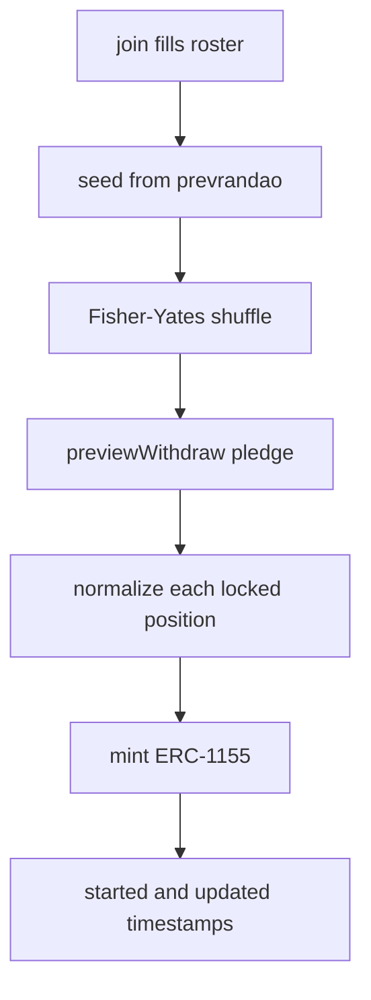

# Start and shuffle

`_start_pasanaku` runs automatically when the final participant joins. It freezes membership, normalizes collateral to the current vault rate, mints soulbound receipts, and opens round accounting.

## Call flow



## Shuffle

Recipient order is not join order. The seed is:

```text
keccak256(abi_encode(block.prevrandao, block.timestamp, token_id))
```

`_shuffle_array` runs a deterministic Fisher-Yates shuffle. After this point, `participants[k]` is the designated recipient of round `k`.

## Pre-start normalization

Pool yield begins here—not at create or join.

For the current pledge asset amount, the contract computes:

```text
target_shares = vault.previewWithdraw(pledge_assets)
```

Then for each participant:

| Condition                | Effect                                                           |
| ------------------------ | ---------------------------------------------------------------- |
| `locked > target_shares` | Excess returns to free shares (pre-start appreciation)           |
| `locked < target_shares` | Top up from free shares, or revert (`pre-start collateral loss`) |
| equal                    | No movement                                                      |

Finally each participant is set to:

- `_locked_shares = target_shares`
- `_locked_asset_basis = pledge_assets`

Basis is recorded only after this normalization. That fixed principal is what end settlement later tries to return.

## Activation side effects

- `_mint_membership_token` for every participant (`_TOKEN_AMOUNT = 1`)
- `started = updated = block.timestamp`
- `_active_pasanaku_count += 1`
- `PasanakuStarted` log

Round deposits and `tick` are valid only after `started != 0`.

## Integrator implications

- Joining with the minimum free shares can still revert at start if the vault rate worsens before the roster fills.
- Holding extra free shares hedges pre-start share-price increases in the required pledge.
- Indexers should treat `PasanakuStarted` as the moment recipient positions become final.

## See also

- [ERC-1155 membership](./membership.md)
- `CONTEXT.md` — Yield start
- `tests/unitary/pasanaku/test_lifecycle.py`, `tests/unitary/erc1155/test_membership_mint.py`
