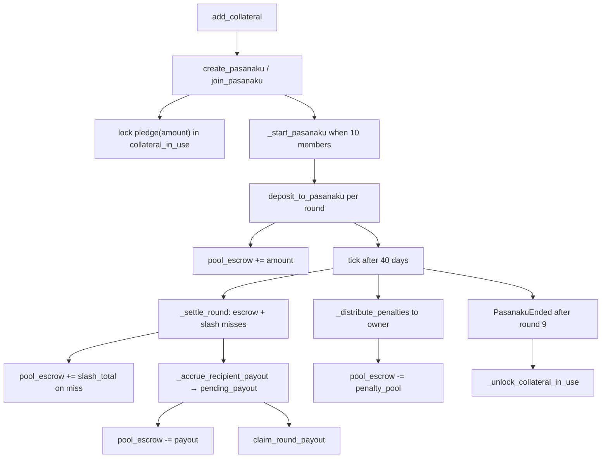

# Protocol lifecycle

Pasanaku runs an onchain rotating savings pool: participants fund collateral, join a ten-member pool, deposit each round, and permissionless ticks settle payouts until the pool ends and pledged collateral unlocks.

## Legend

| Node | Contract surface |
|------|------------------|
| `add_collateral` | `add_collateral(asset, amount)` — credit collateral ledger and pull ERC20 |
| `create_pasanaku / join_pasanaku` | `create_pasanaku(asset, amount)` · `join_pasanaku(token_id)` |
| `lock pledge(amount)` | `_update_collateral_in_use` · view `pledge(amount)` |
| `_start_pasanaku when 10 members` | Internal start on tenth join; mints ERC1155 membership via `_mint_membership_token` |
| `deposit_to_pasanaku per round` | `deposit_to_pasanaku(amount, token_id)` — obligor escrow |
| `pool_escrow += amount` | `_pool_escrow[token_id]` credited after successful `transferFrom` |
| `tick after 40 days` | `tick(token_id)` once `updated + 40 days` elapsed |
| `_settle_round` | Internal — credit recipient payout, slash misses |
| `pool_escrow += slash_total on miss` | Miss branch credits principal + penalty to per-pool ledger |
| `_accrue_recipient_payout → pending_payout` | Internal — debit `pool_escrow`, accrue `pending_payout[token_id][round_idx]` |
| `_distribute_penalties to owner` | Internal — debit `pool_escrow`, transfer miss penalties to `owner()` |
| `claim_round_payout` | `claim_round_payout(token_id, round_idx)` — recipient pulls accrued ERC20 |
| `PasanakuEnded after round 9` | Final tick when `round_idx == N-1` (9) |
| `_unlock_collateral_in_use` | Internal — release pledged collateral per participant |

If this document and the implementation disagree, **`src/Pasanaku.vy` is canonical** (see also `CONTEXT.md`).
