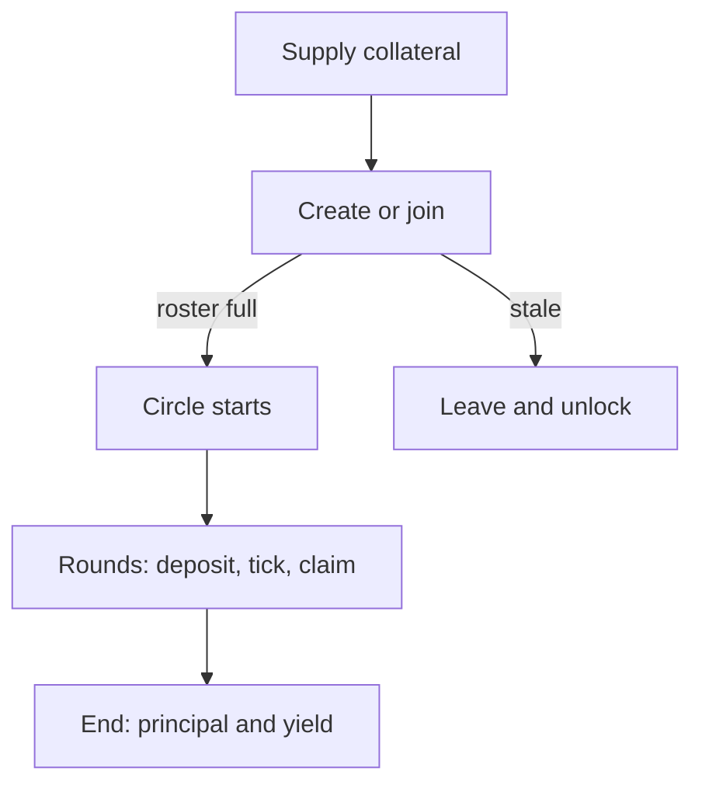

# What is a pasanaku?

Understand the savings-circle idea and how Pasanaku runs it onchain.

## Goal

Know what you are joining: a fixed group, rotating pots, collateral, and shared vault yield.

## The tradition

A pasanaku is a group savings circle. Members agree on a fixed contribution. Each round, everyone who is not receiving the pot pays in; one person collects the combined amount. Over time, each member gets exactly one turn.

The same pattern appears under many names — tanda, susu, chit fund, and others. Families and communities have used it for generations.

## How Pasanaku differs

| Traditional circle | Pasanaku |
| ------------------ | -------- |
| Trust and social pressure | Collateral locked in a vault |
| Informal recipient order | Shuffled payout order when the pool starts |
| Cash or bank transfers | Onchain deposits and pull claims |
| No automatic yield share | Vault appreciation pooled from start to end |

Pasanaku is still a structured circle among exactly three, six, nine, or twelve people — not a bank and not an open-ended fund.

## Lifecycle

1. You supply the deployment’s asset as collateral (vault shares held by the contract).
2. You create or join until the roster is full.
3. The circle starts: order is shuffled, membership receipts mint, yield accounting begins.
4. Each round, obligors fund the per-round amount; after at least 28 days anyone can tick; the recipient claims.
5. After the last tick, principal returns and surplus yield is split by shuffled position.

## What the protocol does

One smart contract instance binds one ERC-20 asset and one ERC-4626 vault. Many pools can run at once. Your pledge locks shares so a missed payment can still cover the pot (when collateral is enough), with a small penalty going to the **pool reserve**, not the protocol owner.

## Common mistakes

- Thinking join order decides who gets paid first — payout order is shuffled at start.
- Expecting yield on collateral before the circle starts — pool yield begins at start.
- Treating estimates of end yield as guaranteed — misses and vault performance change the outcome.

## See also

- [Getting started](/user/getting-started)
- [Create and join](/user/create-and-join)
- [Yield and end](/user/yield-and-end)
- Implementation: [Overview](/guide/overview)
