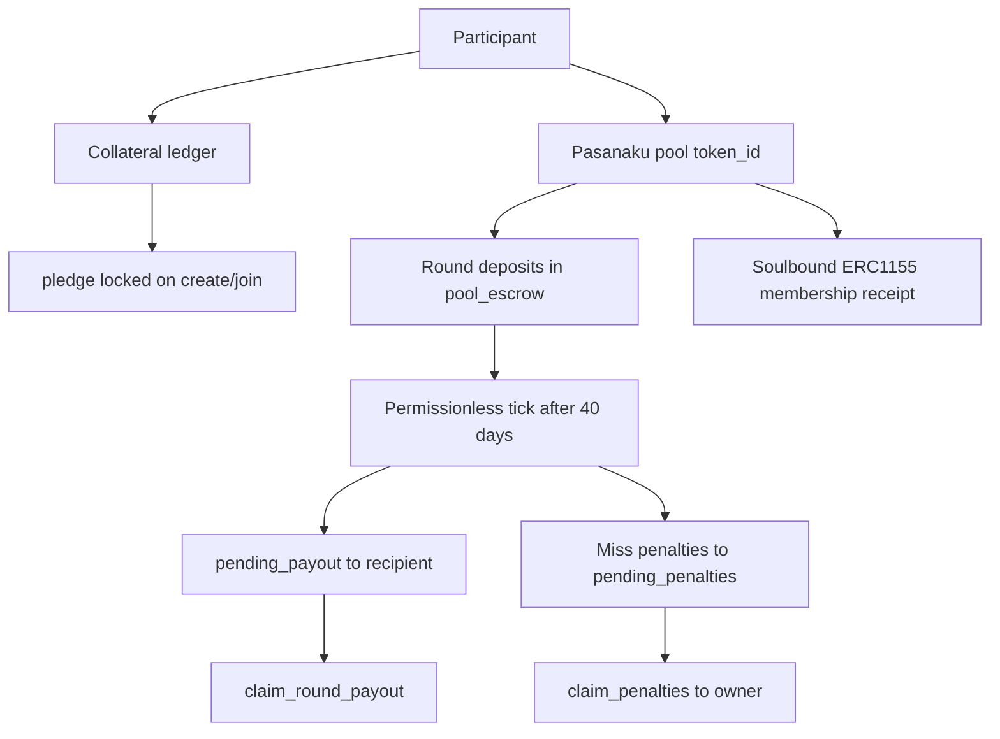
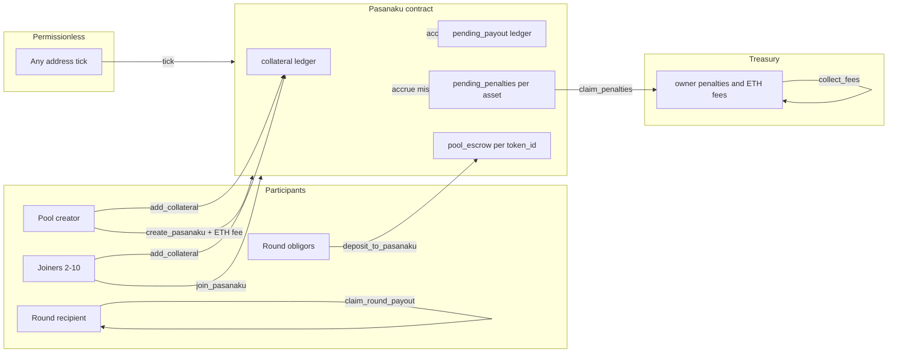

# Pasanaku whitepaper

Pasanaku is a decentralized rotating savings pool on Ethereum. Participants join fixed groups of ten, contribute each round, and take turns receiving payouts — with collateral and permissionless settlement replacing social trust, not eliminating all privileged roles.

**Source of truth:** `src/Pasanaku.vy`. If this document disagrees with the contract, the contract wins.

For integrator APIs, views, and events see the root [README.md](../README.md). For a contract-centric lifecycle diagram see [protocol-flow.md](protocol-flow.md).

---

## 1. Introduction

A **rotating savings and credit association** (ROSCA) — also called a tanda, susu, chit fund, or pasanaku — is a group savings circle. Each period every member pays in; one member receives the collected pot. Over time each member receives exactly one payout. In traditional circles, trust is social: if someone stops paying, the group breaks.

Pasanaku brings that model onchain with **collateral-backed obligations**. Before joining, each participant locks enough collateral to cover all ten round payments plus a small penalty reserve. Round settlement is **permissionless** after each 40-day window. A single defaulter cannot block payouts for the other nine members.

Pasanaku is **trust minimized**, not “100% trustless”: a protocol treasury (`owner()`) receives fees and miss penalties, and deployment chooses supported assets. There is no lending yield, no fiat bridge, and no pause or upgrade on deployed instances.

---

## 2. How it works

| Property | Value |
|----------|-------|
| Participants per pool `N` | 10 |
| Rounds | 10 (one payout per participant) |
| Round deposit window | 40 days from last `updated` timestamp |
| Miss penalty | 5 bps (0.05% of `amount` per missed obligor) |
| Stale pending window | 3–7 days (default 7) before `leave_pasanaku` |

**Typical flow:**

1. **Fund collateral** — `add_collateral(asset, amount)` credits a per-participant ledger.
2. **Create or join** — `create_pasanaku(asset, amount)` (payable, optional ETH fee) or `join_pasanaku(token_id)`. Each action locks `pledge(amount)` in `collateral_in_use`.
3. **Auto-start** — When the tenth member joins, the pool starts, membership is fixed, and soulbound ERC-1155 receipts are minted.
4. **Ten rounds** — For round index `k`, recipient `participants[k]` does not deposit; the other nine each transfer exactly `amount` via `deposit_to_pasanaku`.
5. **Settle** — After `updated + 40 days`, anyone may call `tick`. The recipient is credited `(N - 1) × amount` principal; misses slash collateral and accrue penalties to `pending_penalties` (later claimed via `claim_penalties`).
6. **Claim** — The recipient calls `claim_round_payout(token_id, k)` to receive accrued ERC20.
7. **End** — After round 9 settles, pledged collateral unlocks (net of prior slashes).

**Stale pending pools:** If a pool never reaches ten members before `created + stale_time`, any participant may `leave_pasanaku` to unlock their pledge and exit. Removal preserves relative join order of remaining participants.

Honest participation is cheaper than defaulting: collateral covers missed principal plus a penalty, while the recipient still receives full credit for each obligor slot.

---

## 3. Protocol architecture

Pasanaku is a **single non-upgradeable contract** combining pool logic, collateral ledger, per-pool ERC20 escrow, and soulbound ERC-1155 membership metadata.

**Actor roles:**

| Actor | Role |
|-------|------|
| **Participant** | Collateral, create/join, deposit, claim, leave stale pending |
| **Permissionless caller** | `tick` after the 40-day window; `claim_penalties` |
| **Owner** | Receives ETH creation fees and ERC20 miss penalties (via `claim_penalties`); configures `set_fee` and `set_stale_time` — does not operate rounds |

For step-by-step contract internals, see [protocol-flow.md](protocol-flow.md).

---

## 4. Economics

### Formulas

| Quantity | Formula | Meaning |
|----------|---------|---------|
| Per-round obligor deposit | `amount` | Exact ERC20 units each non-recipient must transfer |
| Recipient payout (full round) | `(N - 1) × amount` | Nine obligor principals |
| Collateral lock | `pledge(amount) = amount × N + amount × N × MISS_PENALTY_BPS / 10000` | Locked on create/join; released after pool ends |
| Miss penalty per obligor | `amount × MISS_PENALTY_BPS / 10000` | Slashed from collateral if deposit missing at tick |

### Worked example (USDC, 6 decimals)

`amount = 100_000_000` (100 USDC):

| Quantity | Value |
|----------|-------|
| Per-round obligor deposit | 100 USDC |
| Recipient payout (full round) | 900 USDC |
| Pledge lock | 1,000 USDC + 0.5 USDC penalty reserve |
| One miss at tick | Recipient gets 100 USDC from slash; 0.05 USDC penalty accrues for later `claim_penalties` |

Over ten rounds each participant pays nine obligor deposits and receives one recipient payout (900 USDC in this example), net of any collateral slashes.

Penalties do **not** reduce the recipient’s principal target for that round — they are an additional sink on top of obligor collateral.

---

## 5. Fees and revenue

Two revenue streams are implemented in core-v2; both flow to `owner()` today.

### Creation fee (ETH)

| Property | Value |
|----------|-------|
| Charged on | `create_pasanaku` only |
| Range | 0 to 0.001 ETH |
| Default at deploy | 0 |
| Admin | `set_fee(fee)` — owner only |
| Collection | `collect_fees()` — sweeps contract ETH balance to `owner()` |

`join_pasanaku` does not require ETH. The creation fee is independent of ERC20 collateral and miss penalties.

### Miss penalty (ERC20)

When an obligor misses a deposit at tick, `amount × 5 / 10000` is slashed and accrued to `pending_penalties(asset)` via `_distribute_penalties` (logged in `PasanakuPenalties`). Anyone may later call `claim_penalties(asset)` to transfer to current `owner()` (emits `PenaltiesClaimed`). `tick` does not ERC20-transfer penalties.

| Source | Asset | Recipient |
|--------|-------|-----------|
| Pool creation | ETH | `owner()` via `collect_fees()` |
| Missed deposits | Pool ERC20 | Accrue on tick; `owner()` via `claim_penalties(asset)` |

---

## 6. Governance

### Today (deployed)

Core-v2 uses **Ownable two-step admin**:

- `owner()` is the protocol treasury — receives ETH creation fees and ERC20 miss penalties (via `claim_penalties`).
- Owner may call `set_fee`, `set_stale_time`, and `collect_fees`.
- Owner **cannot** force-settle rounds, redirect recipient payouts, pause pools, or upgrade the contract.
- Round advancement remains **permissionless** via `tick`.

### Roadmap (planned — not deployed)

A future **NAKU** governance token may:

- Govern protocol parameters (fees, stale windows, treasury policy) via onchain proposals.
- Distribute a share of protocol revenue to stakers who participate in governance.
- Decentralize treasury disbursement beyond a single `owner()`.

**Nothing in this roadmap section is live in core-v2.** Current deployments use fixed non-upgradeable instances with Ownable admin only. Membership ERC-1155 tokens are soulbound today; any future tradability would require new contract logic.

---

## 7. Security boundaries

**What the protocol provides:**

- Collateralized obligations — join locks `pledge(amount)`; misses slash `amount + penalty` while still crediting recipients.
- Permissionless settlement — anyone may `tick` after the window elapses.
- Fixed membership after start — no late joins; ERC-1155 transfers revert.
- Per-pool isolation — `pool_escrow` attributes ERC20 per `token_id` even when multiple pools share an asset.

**What it does not claim:**

- Not safe for arbitrary ERC20s — fee-on-transfer and rebasing tokens can break accounting.
- Not protected by admin circuit breakers — no pause, force-settle, or emergency override.
- Not push payouts — recipients must `claim_round_payout`; unclaimed principal remains on the contract. Miss penalties similarly accrue until `claim_penalties`.
- Not automatic stale refunds — each participant must call `leave_pasanaku` individually.

Key invariants are enforced by the Titanoboa test suite (`mox test`). See [README.md](../README.md) — Security assumptions and Invariant-first testing.

---

## 8. Membership receipt (ERC-1155)

Each started pool mints one soulbound ERC-1155 token (amount 1) per participant, keyed by pool `token_id`.

- `safeTransferFrom`, `safeBatchTransferFrom`, and `setApprovalForAll` revert.
- `uri(token_id)` returns IPFS metadata for **pending**, **stale**, **ongoing**, or **ended** states.

The receipt is a wallet-visible membership record, not a tradable asset or governance token. See [ADR-0004: Soulbound membership receipt](adr/0004-soulbound-membership-receipt.md).

---

## 9. References

| Document | Purpose |
|----------|---------|
| [README.md](../README.md) | Integrator reference — formulas, views, events, testing |
| [protocol-flow.md](protocol-flow.md) | Contract-centric lifecycle diagram |
| [CONTEXT.md](../CONTEXT.md) | Domain glossary and wording guardrails |
| [docs/README.md](README.md) | Documentation hub |
| [docs/adr/](adr/) | Architecture decision records |
| `src/Pasanaku.vy` | Canonical onchain behavior and NatSpec |

Extended chapter-by-chapter narrative (including design goals and limitations) lives under [docs/whitepaper/](whitepaper/).
