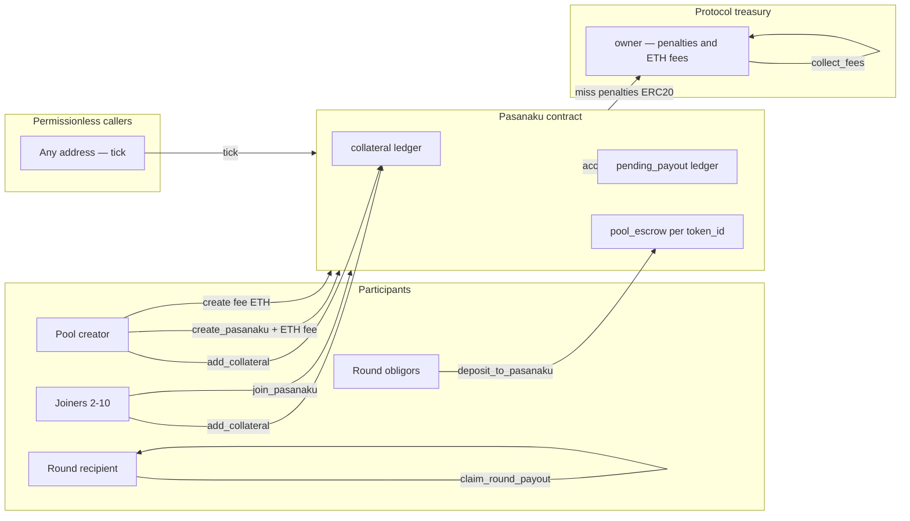
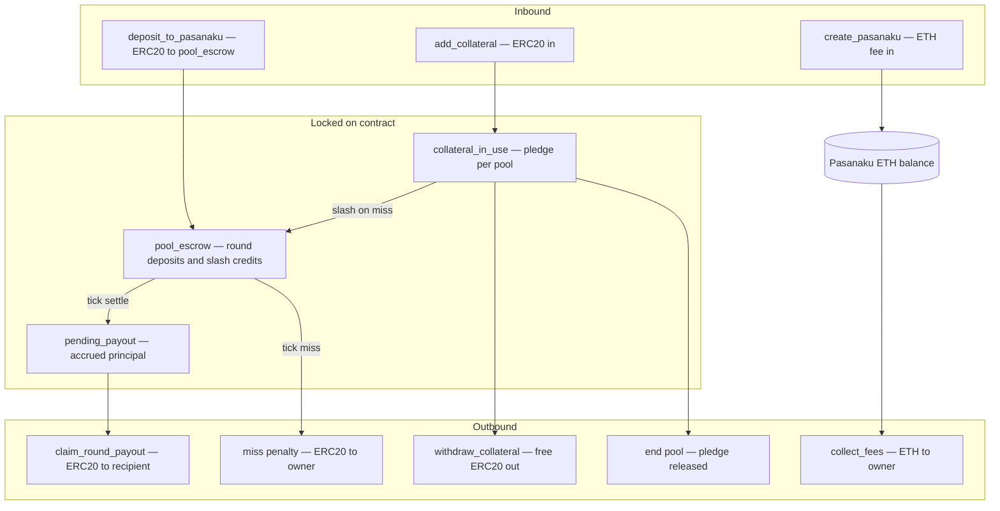

# 03. Architecture

Pasanaku is a **single non-upgradeable contract** that combines:

- Rotating savings pool logic (create, join, deposit, tick, end)
- Per-participant collateral ledger
- Per-pool ERC20 escrow (`pool_escrow`)
- Soulbound ERC-1155 membership receipts (metadata via `uri()`)

There are no external keeper contracts, no proxy, and no separate vault in core-v2.

## Actor diagram

User-facing roles and trust boundaries:

| Actor | Role | Trust required |
|-------|------|----------------|
| **Participant** | Collateral, create/join, deposit, claim | Contract math and ERC20 |
| **Permissionless tick caller** | Advances rounds after 40 days | None — public function |
| **Owner** | Receives penalties and ETH fees; sets fee and stale time | Does not control tick or payouts |
| **Recipient** | Must actively claim each round payout | Contract will hold until claim |

For contract-internal step order, see [protocol-flow.md](../protocol-flow.md).

## Money flow

How ERC20 and ETH move through the system:

**Collateral vs escrow:** Collateral backs obligations and absorbs slashes. Round deposits sit in `pool_escrow` until tick moves value to `pending_payout` or penalties.

## Key storage surfaces

| Ledger | Purpose |
|--------|---------|
| `_collateral[account][asset]` | Participant-funded backing |
| `_collateral_in_use[account][asset]` | Pledged portion per active pool |
| `_pool_escrow[token_id]` | Per-pool ERC20 attribution |
| `_pending_payout[token_id][round_idx]` | Accrued recipient principal |
| `_pasanakus[token_id]` | Pool struct (participants, index, timestamps) |

## Architecture decisions

- [ADR-0001: Pull-claim payouts](../adr/0001-pull-claim-payouts.md)
- [ADR-0002: No single active pool cap](../adr/0002-no-single-active-pool-cap.md)
- [ADR-0003: Stale pending exit](../adr/0003-stale-pending-exit.md)

---

> **Implemented today**
>
> Single-contract deployment with the actors and ledgers above. Diagrams match `src/Pasanaku.vy`. Integrator views: [README.md](../../README.md) — Integrator / indexer playbook.
